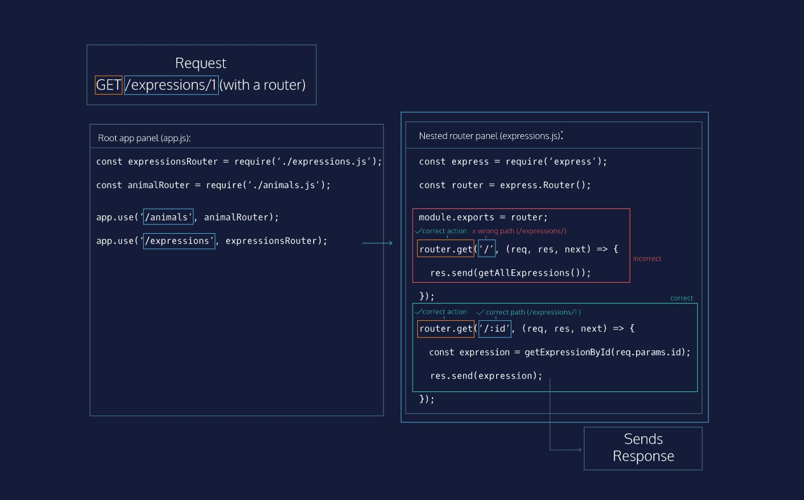

# This File Is Too Big!
Your Expressions/Animals routes are all working well, and our machine is fully functional! Our app.js file, however, is getting quite long and hard to read. It’s easy to imagine that as we add functionality to an application, this file would get long and cumbersome.

Luckily, Express provides functionality to alleviate this problem: Routers. Routers are mini versions of Express applications — they provide functionality for handling route matching, requests, and sending responses, but they do not start a separate server or listen on their own ports. Routers use all the .get(), .put(), .post(), and .delete() routes that you know and love.

In this lesson, we will use Routers to clean up our code and separate our application into a file to handle all /expressions routes, and another to handle all /animals routes.

# Express.Router
An Express router provides a subset of Express methods. To create an instance of one, we invoke the .Router() method on the top-level Express import.

To use a router, we mount it at a certain path using app.use() and pass in the router as the second argument. This router will now be used for all paths that begin with that path segment. To create a router to handle all requests beginning with /monsters, the code would look like this:
```js
const express = require('express');
const app = express();
 
const monsters = {
  '1': {
    name: 'godzilla',
    age: 250000000
  },
  '2': {
    Name: 'manticore',
    age: 21
  }
}
 
const monstersRouter = express.Router();
 
app.use('/monsters', monstersRouter);
 
monstersRouter.get('/:id', (req, res, next) => {
  const monster = monsters[req.params.id];
  If (monster) {
    res.send(monster);
  } else {
    res.status(404).send();
  }
});
```

Inside the monstersRouter, all matching routes are assumed to have /monsters prepended, as it is mounted at that path. monstersRouter.get('/:id') matches the full path /monsters/:id.

When a GET /monsters/1 request arrives, Express matches /monsters in app.use() because the beginning of the path ('/monsters') matches. Express’ route-matching algorithm enters the monstersRouter‘s routes to search for full path matches. Since monstersRouter.get('/:id) is mounted at /monsters, the two paths together match the entire request path (/monsters/1), so the route matches and the callback is invoked. The 'godzilla' monster is fetched from the monsters array and sent back.

**Instructions**
1. Create an expressionsRouter instance of Express.Router. Mount it at /expressions at your base app level with app.use.

After doing so, create a route for your expressionsRouter that will send all expressions for a GET request.

**Hint**

Remember, if the expressionsRouter is mounted properly at /expressions, the GET request for all expressions will use the '/' path inside the expressionsRouter.

**Answer**
```js
const express = require('express');
const app = express();

const { getElementById, getIndexById, updateElement,
  seedElements, createElement } = require('./utils');

const PORT = process.env.PORT || 4001;
// Use static server to serve the Express Yourself Website
app.use(express.static('public'));

const expressions = [];
seedElements(expressions, 'expressions');
const animals = [];
seedElements(animals, 'animals');

const expressionsRouter = express.Router();
app.use('/expressions', expressionsRouter);

// Get all expressions
expressionsRouter.get('/', (req, res, next) => {
  res.send(expressions);
});

// Get a single expression
app.get('/expressions/:id', (req, res, next) => {
  const foundExpression = getElementById(req.params.id, expressions);
  if (foundExpression) {
    res.send(foundExpression);
  } else {
    res.status(404).send();
  }
});

// Update an expression
app.put('/expressions/:id', (req, res, next) => {
  const expressionIndex = getIndexById(req.params.id, expressions);
  if (expressionIndex !== -1) {
    updateElement(req.params.id, req.query, expressions);
    res.send(expressions[expressionIndex]);
  } else {
    res.status(404).send();
  }
});

// Create an expression
app.post('/expressions', (req, res, next) => {
  const receivedExpression = createElement('expressions', req.query);
  if (receivedExpression) {
    expressions.push(receivedExpression);
    res.status(201).send(receivedExpression);
  } else {
    res.status(400).send();
  }
});

// Delete an expression
app.delete('/expressions/:id', (req, res, next) => {
  const expressionIndex = getIndexById(req.params.id, expressions);
  if (expressionIndex !== -1) {
    expressions.splice(expressionIndex, 1);
    res.status(204).send();
  } else {
    res.status(404).send();
  }
});

// Get all animals
app.get('/animals', (req, res, next) => {
  res.send(animals);
});

// Get a single animal
app.get('/animals/:id', (req, res, next) => {
  const animal = getElementById(req.params.id, animals);
  if (animal) {
    res.send(animal);
  } else {
    res.status(404).send();
  }
});

// Create an animal
app.post('/animals', (req, res, next) => {
  const receivedAnimal = createElement('animals', req.query);
  if (receivedAnimal) {
    animals.push(receivedAnimal);
    res.status(201).send(receivedAnimal);
  } else {
    res.status(400).send();
  }
});

// Update an animal
app.put('/animals/:id', (req, res, next) => {
  const animalIndex = getIndexById(req.params.id, animals);
  if (animalIndex !== -1) {
    updateElement(req.params.id, req.query, animals);
    res.send(animals[animalIndex]);
  } else {
    res.status(404).send();
  }
});

// Delete a single animal
app.delete('/animals/:id', (req, res, next) => {
  const animalIndex = getIndexById(req.params.id, animals);
  if (animalIndex !== -1) {
    animals.splice(animalIndex, 1);
    res.status(204).send();
  } else {
    res.status(404).send();
  }
});

app.listen(PORT, () => {
  console.log(`Server is listening on ${PORT}`);
});
```

# Exercise: Using Multiple Router Files
Generally, we will keep each router in its own file, and require them in the main application. This allows us to keep our code clean and our files short.

To do this with monstersRouter, we would create a new file monsters.js and move all code related to /monsters requests into it.
```js
// monsters.js
const express = require('express');
const monstersRouter = express.Router();
 
const monsters = {
  '1': {
    name: 'godzilla',
    age: 250000000
  },
  '2': {
    Name: 'manticore',
    age: 21
  }
}
 
monstersRouter.get('/:id', (req, res, next) => {
  const monster = monsters[req.params.id];
  if (monster) {
    res.send(monster);
  } else {
    res.status(404).send();
  }
});
 
module.exports = monstersRouter;
```

This code contains all the monsters specific code. In a more full-fledged API, this file would contain multiple routes. To use this router in another file, we use module.exports so that other files can access monstersRouter. The only other new line of code required is that Express must be required in each file, since we’ll need to create a router with express.Router().

Our main.js file could then be refactored to import the monstersRouter:
```js
// main.js
const express = require('express');
const app = express();
const monstersRouter = require('./monsters.js');
 
app.use('/monsters', monstersRouter);
```

In this example, the monstersRouter is required in main.js from monsters.js and used exactly as it was before.

**Instructions**
1. Let’s start to refactor our /expressions routes to expressions.js.

Open the expressions.js file. Create an expressionsRouter instance of Express.Router.

Export expressionsRouter from that file with module.exports. Remove your old expressionsRouter from app.js. require your expressionsRouter from expressions.js into app.js and make sure it is mounted at /expressions.

Move your GET /expressions handler from app.js to expressions.js. You’ll have to also move the expressions array to that file. Finally, make sure that you move the seedElements(expressions) line into expressions.js.

**Answer**

**app.js**
```js
const express = require('express');
const app = express();

const { getElementById, getIndexById, updateElement,
  seedElements, createElement } = require('./utils');

const PORT = process.env.PORT || 4001;
// Use static server to serve the Express Yourself Website
app.use(express.static('public'));

let animals = [];
seedElements(animals, 'animals');

const expressionsRouter = require('./expressions.js');

app.use('/expressions', expressionsRouter);

// Get a single expression
app.get('/expressions/:id', (req, res, next) => {
  const foundExpression = getElementById(req.params.id, expressions);
  if (foundExpression) {
    res.send(foundExpression);
  } else {
    res.status(404).send();
  }
});

// Update an expression
app.put('/expressions/:id', (req, res, next) => {
  const expressionIndex = getIndexById(req.params.id, expressions);
  if (expressionIndex !== -1) {
    updateElement(req.params.id, req.query, expressions);
    res.send(expressions[expressionIndex]);
  } else {
    res.status(404).send();
  }
});

// Create an expression
app.post('/expressions', (req, res, next) => {
  const receivedExpression = createElement('expressions', req.query);
  if (receivedExpression) {
    expressions.push(receivedExpression);
    res.status(201).send(receivedExpression);
  } else {
    res.status(400).send();
  }
});

// Delete an expression
app.delete('/expressions/:id', (req, res, next) => {
  const expressionIndex = getIndexById(req.params.id, expressions);
  if (expressionIndex !== -1) {
    expressions.splice(expressionIndex, 1);
    res.status(204).send();
  } else {
    res.status(404).send();
  }
});

// Get all animals
app.get('/animals', (req, res, next) => {
  res.send(animals);
});

// Get a single animal
app.get('/animals/:id', (req, res, next) => {
  const animal = getElementById(req.params.id, animals);
  if (animal) {
    res.send(animal);
  } else {
    res.status(404).send();
  }
});

// Create an animal
app.post('/animals', (req, res, next) => {
  const receivedAnimal = createElement('animals', req.query);
  if (receivedAnimal) {
    animals.push(receivedAnimal);
    res.status(201).send(receivedAnimal);
  } else {
    res.status(400).send();
  }
});

// Update an animal
app.put('/animals/:id', (req, res, next) => {
  const animalIndex = getIndexById(req.params.id, animals);
  if (animalIndex !== -1) {
    updateElement(req.params.id, req.query, animals);
    res.send(animals[animalIndex]);
  } else {
    res.status(404).send();
  }
});

// Delete a single animal
app.delete('/animals/:id', (req, res, next) => {
  const animalIndex = getIndexById(req.params.id, animals);
  if (animalIndex !== -1) {
    animals.splice(animalIndex, 1);
    res.status(204).send();
  } else {
    res.status(404).send();
  }
});

app.listen(PORT, () => {
  console.log(`Server is listening on ${PORT}`);
});
```

**expressions.js**
```js
const express = require('express');
const { seedElements, getElementById, createElement, updateElement, getIndexById } = require('./utils');

let expressions = [];
seedElements(expressions, 'expressions');

const expressionsRouter = express.Router();

module.exports = expressionsRouter;

// Get all expressions
expressionsRouter.get('/', (req, res, next) => {
  res.send(expressions);
});
```

# Matching In Nested Routers
As you saw in the previous exercise, when using routers, it’s important to remember that the full path of a request can be segmented.

In the diagram to the left, you can create an Express application using two routers. A GET request arrives for /expressions/1. Because the beginning of the path does not match /animals in the first app.use(), the Express server moves on to the next app.use(), which matches /expressions.

Express’ route matching algorithm then enters the expressionsRouter instance which is required from expressions.js. Inside this router, the path matching changes. Even though the whole request path is /expressions/1, inside the expressionsRouter, all paths are matched from the parts of the path after /expressions, meaning that in this context, the router is trying to match the path /1.

Because the path is /1, the path does not match the first .get() method at /. The Express server moves on to the next route, which has a route parameter of /:id, so it matches! This route handles the necessary logic and sends the response.

Routers can be nested as many times as necessary for an application, so understanding nested route matching is important for created complicated APIs.



# Refactoring Expressions Routes
Now that you’ve learned about nested route matching, let’s refactor the rest of the /expressions routes into expressions.js.

**Instructions**

1. Move all your /expressions routes to your router into expressions.js. Make sure that they still match the same request paths, and remove the duplicate code from app.js.

Move the following routes to expresions.js:

- GET /expressions/:id
- PUT /expressions/:id
- POST /expressions
- DELETE /expressions/:id

Remember to change the paths for each route handler as you move them, as they should already be mounted at /expressions inside expressions.js.

Make sure that you still require the same helper functions from utils.js in expressions.js.

**Hint**
You’ll need all these helper functions in expressions.js: getElementById, getIndexById, updateElement, seedElements, createElement

**Answer**
