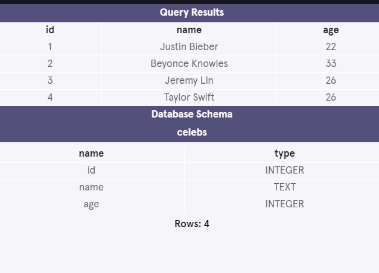
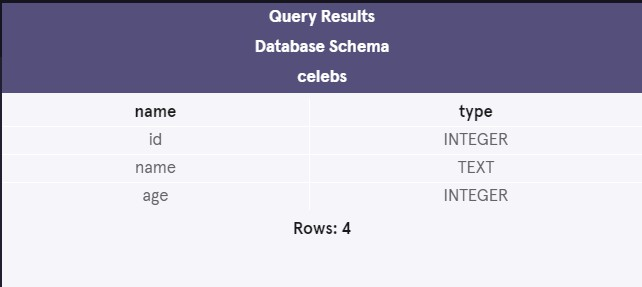
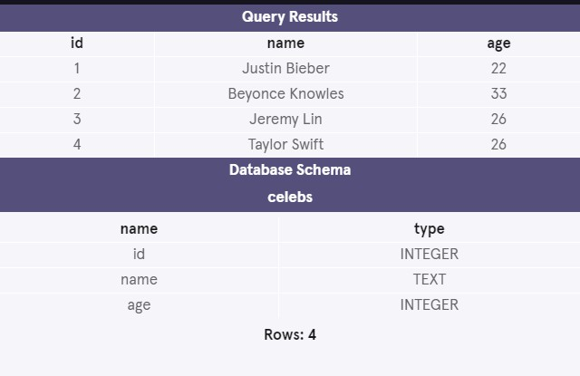
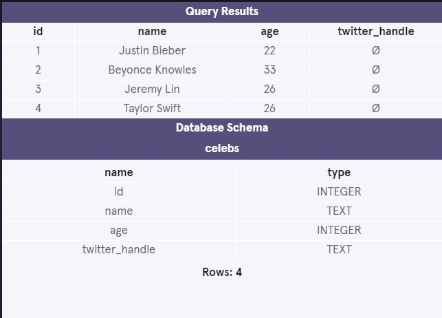
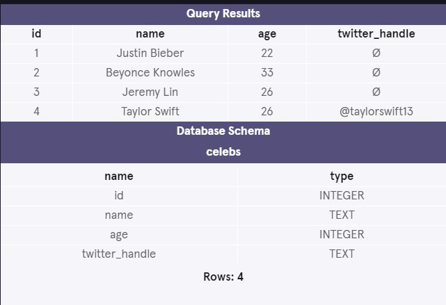
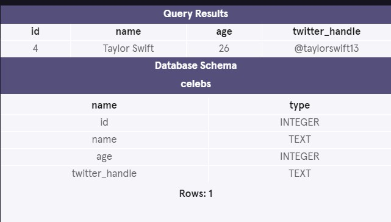
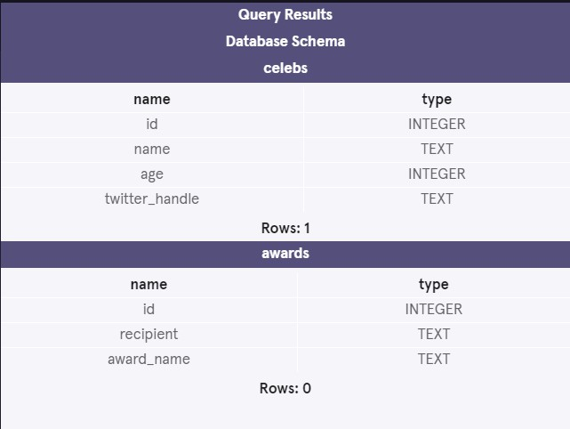

# Introduction to SQL

SQL, **S**tructured **Q**uery **L**anguage, is a programming language designed to manage data stored in relational databases. SQL operates through simple, declarative statements. This keeps data accurate and secure, and helps maintain the integrity of databases, regardless of size.

The SQL language is widely used today across web frameworks and database applications. Knowing SQL gives you the freedom to explore your data, and the power to make better decisions. By learning SQL, you will also learn concepts that apply to nearly every data storage system.

The statements covered in this course use SQLite Relational Database Management System (RDBMS). You can also access a glossary of all the SQL commands taught in this course.

**Instructions**
1. Let’s begin by entering a SQL command.

In the code editor, type:
```sql
SELECT * FROM celebs;
```

You will run all of your SQL commands in this course by pressing the Run button at the bottom of the code editor.

**Answer**
```sql
SELECT * FROM celebs;
```


# Relational Databases
Nice work! In one line of code, you returned information from a relational database.
```sql
SELECT * FROM celebs;
```

We’ll take a look at what this code means soon, for now, let’s focus on what relational databases are and how they are organized.

- A *relational database* is a database that organizes information into one or more tables. Here, the relational database contains one table.
- A *table* is a collection of data organized into rows and columns. Tables are sometimes referred to as relations. Here the table is `celebs`.
- A *column* is a set of data values of a particular type. Here, `id`, `name`, and `age` are the columns.
- A *row* is a single record in a table. The first row in the celebs table has:
  - An `id` of 1
  - A `name` of Justin Bieber
  - An `age` of 22

All data stored in a relational database is of a certain data type. Some of the most common data types are:
  - `INTEGER`, a positive or negative whole number
  - `TEXT`, a text string
  - `DATE`, the date formatted as YYYY-MM-DD
  - `REAL`, a decimal value
  
  
# Statements
The code below is a SQL statement. A statement is text that the database recognizes as a valid command. Statements always end in a semicolon ;.
```sql
CREATE TABLE table_name (
   column_1 data_type, 
   column_2 data_type, 
   column_3 data_type
);
```

Let’s break down the components of a statement:
- `CREATE TABLE` is a clause. Clauses perform specific tasks in SQL. By convention, clauses are written in capital letters. Clauses can also be referred to as commands.
- `table_name` refers to the name of the table that the command is applied to.
- `(column_1 data_type, column_2 data_type, column_3 data_type)` is a parameter. A parameter is a list of columns, data types, or values that are passed to a clause as an argument. Here, the parameter is a list of column names and the associated data type.

The structure of SQL statements vary. The number of lines used does not matter. A statement can be written all on one line, or split up across multiple lines if it makes it easier to read. In this course, you will become familiar with the structure of common statements.

**Instructions**
1. Let’s take a closer look at the statement we wrote before. In the code editor, type:
```sql
SELECT * FROM celebs;
```

Run the code to observe the results, and ask yourself:

Which parts of the statement are the clauses?
What table are we applying the command to?
Uncover the hint to view the answers, and then proceed to the next exercise.

**Answer and Hint**
SELECT and FROM are the clauses here.
We are applying the command to the celebs table.

# Create
CREATE statements allow us to create a new table in the database. You can use the CREATE statement anytime you want to create a new table from scratch. The statement below creates a new table named `celebs`.
```sql
CREATE TABLE celebs (
   id INTEGER, 
   name TEXT, 
   age INTEGER
);
```

1. `CREATE TABLE` is a clause that tells SQL you want to create a new table.
2. `celebs` is the name of the table.
3. `(id INTEGER, name TEXT, age INTEGER)` is a list of parameters defining each column, or attribute in the table and its data type:
  - `id` is the first column in the table. It stores values of data type `INTEGER`
  - `name` is the second column in the table. It stores values of data type `TEXT`
  - `age` is the third column in the table. It stores values of data type `INTEGER`

**Instructions**
1. Now that you have a good understanding of SQL syntax, we can create a new table. We’ve cleared the database from the previous exercises. Confirm no celebs table exists by entering the following in the code editor:
```sql
SELECT * FROM celebs;
```
Look at the results. The database should be empty!

2. Now that we know the database is empty, let’s create a new celebs table.

In the code editor, type:
```sql
CREATE TABLE celebs (
   id INTEGER, 
   name TEXT, 
   age INTEGER
); 
```
We will learn how to view this table in a later exercise after we have added some data to it.

# Insert
The INSERT statement inserts a new row into a table. You can use the INSERT statement when you want to add new records. The statement below enters a record for Justin Bieber into the celebs table.
```sql
INSERT INTO celebs (id, name, age) 
VALUES (1, 'Justin Bieber', 22);
```

1. `INSERT INTO` is a clause that adds the specified row or rows.
2. `celebs` is the name of the table the row is added to.
3. `(id, name, age)` is a parameter identifying the columns that data will be inserted into.
4. `VALUES` is a clause that indicates the data being inserted.
`(1, 'Justin Bieber', 22)` is a parameter identifying the values being inserted.

- `1` is an integer that will be inserted into the id column
- `'Justin Bieber'` is text that will be inserted into the name column
- `22` is an integer that will be inserted into the age column

**Instructions**

1. Add a row to the table. In the code editor, type:
```sql
INSERT INTO celebs (id, name, age) 
VALUES (1, 'Justin Bieber', 22); 
```
Look at the Database Schema. How many rows are in the celebs table?

2. Add three more celebrities to the table. Beneath your previous INSERT statement type:
```sql
INSERT INTO celebs (id, name, age) 
VALUES (2, 'Beyonce Knowles', 33); 
 
INSERT INTO celebs (id, name, age) 
VALUES (3, 'Jeremy Lin', 26); 
 
INSERT INTO celebs (id, name, age) 
VALUES (4, 'Taylor Swift', 26); 
```
Look at the Database Schema. How many rows are in the celebs table now?



# Select
SELECT statements are used to fetch data from a database. In the statement below, SELECT returns all data in the name column of the celebs table.
```sql
SELECT name FROM celebs;
```
1. `SELECT` is a clause that indicates that the statement is a query. You will use SELECT every time you query data from a database.
2. `name` specifies the column to query data from.
3. `FROM celebs` specifies the name of the table to query data from. In this statement, data is queried from the celebs table.

You can also query data from all columns in a table with SELECT.
```sql
SELECT * FROM celebs;
```
`*` is a special wildcard character that we have been using. It allows you to select every column in a table without having to name each one individually. Here, the result set contains every column in the celebs table.

SELECT statements always return a new table called the result set.

**Instructions**
1. Let’s take a closer look at SELECT and retrieve all the names in the celebs table. In the code editor, type:
```sql
SELECT name FROM celebs; 
```

2. Delete your previous `SELECT` statement from the code editor.

To SELECT all the data in the celeb table, enter the following statement in the code editor using the * wildcard character:
```sql
SELECT * FROM celebs;
```



# Alter
The ALTER TABLE statement adds a new column to a table. You can use this command when you want to add columns to a table. The statement below adds a new column twitter_handle to the celebs table.
```sql
ALTER TABLE celebs 
ADD COLUMN twitter_handle TEXT;
```
1. `ALTER TABLE` is a clause that lets you make the specified changes.
2. `celebs` is the name of the table that is being changed.
3. `ADD COLUMN` is a clause that lets you add a new column to a table:
- `twitter_handle` is the name of the new column being added
- `TEXT` is the data type for the new column
4. `NULL` is a special value in SQL that represents missing or unknown data. Here, the rows that existed before the column was added have NULL (∅) values for twitter_handle.

**Instructions**
1. Add a new column to the table. In the code editor, type:
```sql
ALTER TABLE celebs 
ADD COLUMN twitter_handle TEXT; 
 
SELECT * FROM celebs; 
```



# Update
The UPDATE statement edits a row in a table. You can use the UPDATE statement when you want to change existing records. The statement below updates the record with an id value of 4 to have the twitter_handle @taylorswift13.
```sql
UPDATE celebs 
SET twitter_handle = '@taylorswift13' 
WHERE id = 4; 
```

1. `UPDATE` is a clause that edits a row in the table.
2. `celebs` is the name of the table.
3. `SET` is a clause that indicates the column to edit.
- `twitter_handle` is the name of the column that is going to be updated
- `@taylorswift13` is the new value that is going to be inserted into the `twitter_handle` column.
4. `WHERE` is a clause that indicates which row(s) to update with the new column value. Here the row with a 4 in the id column is the row that will have the twitter_handle updated to @taylorswift13.

**Instructions**
1. Update the table to include Taylor Swift’s twitter handle. In the code editor, type:
```sql
UPDATE celebs 
SET twitter_handle = '@taylorswift13' 
WHERE id = 4; 
 
SELECT * FROM celebs;
```


# Delete
The DELETE FROM statement deletes one or more rows from a table. You can use the statement when you want to delete existing records. The statement below deletes all records in the celeb table with no twitter_handle:
```sql
DELETE FROM celebs 
WHERE twitter_handle IS NULL;
```

- `DELETE FROM` is a clause that lets you delete rows from a table.
- `celebs` is the name of the table we want to delete rows from.
- `WHERE` is a clause that lets you select which rows you want to delete. Here we want to delete all of the rows where the twitter_handle column IS NULL.
- `IS NULL` is a condition in SQL that returns true when the value is NULL and false otherwise.

**Instructions**
1. Delete all of the rows that have a NULL value in the twitter handle column. In the code editor, type the following:
```sql
DELETE FROM celebs 
WHERE twitter_handle IS NULL;
 
SELECT * FROM celebs; 
```
How many rows exist in the celebs table now?


# Constraints
Constraints that add information about how a column can be used are invoked after specifying the data type for a column. They can be used to tell the database to reject inserted data that does not adhere to a certain restriction. The statement below sets constraints on the celebs table.
```sql
CREATE TABLE celebs (
   id INTEGER PRIMARY KEY, 
   name TEXT UNIQUE,
   date_of_birth TEXT NOT NULL,
   date_of_death TEXT DEFAULT 'Not Applicable'
);
```
1. `PRIMARY KEY` columns can be used to uniquely identify the row. Attempts to insert a row with an identical value to a row already in the table will result in a constraint violation which will not allow you to insert the new row.
2. `UNIQUE` columns have a different value for every row. This is similar to `PRIMARY KEY` except a table can have many different UNIQUE columns.
3. `NOT NULL` columns must have a value. Attempts to insert a row without a value for a NOT NULL column will result in a constraint violation and the new row will not be inserted.
4. `DEFAULT` columns take an additional argument that will be the assumed value for an inserted row if the new row does not specify a value for that column.

**Instructions**
1. Create a new table with constraints on the values. In the code editor type:
```sql
CREATE TABLE awards (
   id INTEGER PRIMARY KEY,
   recipient TEXT NOT NULL,
   award_name TEXT DEFAULT 'Grammy'
);
```
How many tables do you see in the database schema on the right?


# Review
Congratulations! We’ve learned six commands commonly used to manage data stored in a relational database and how to set constraints on such data. What can we generalize so far?

SQL is a programming language designed to manipulate and manage data stored in relational databases.

- `A relational database` is a database that organizes information into one or more tables.
- `A table` is a collection of data organized into rows and columns.

A statement is a string of characters that the database recognizes as a valid command.
- `CREATE TABLE` creates a new table.
- `INSERT INTO` adds a new row to a table.
- `SELECT` queries data from a table.
- `ALTER TABLE` changes an existing table.
- `UPDATE` edits a row in a table.
- `DELETE` FROM deletes rows from a table.

Constraints add information about how a column can be used.
