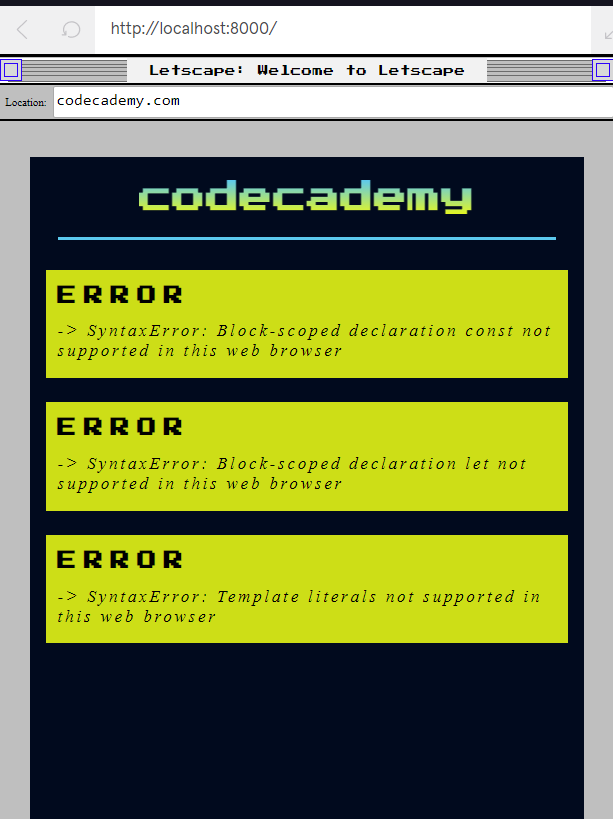

# Introduction
You’re probably prompted to update your web browser every few months. Do you know why? A few reasons include addressing security vulnerabilities, adding features, and supporting new HTML, CSS, and JavaScript syntax.

The reasons above imply there is a period before a software update is released when there are security vulnerabilities and unsupported language syntax.

This lesson focuses on the latter. Specifically, how developers address the gap between the new JavaScript syntax that they use and the JavaScript syntax that web browsers recognize.

This has become a widespread concern for web developers since Ecma International, the organization responsible for standardizing JavaScript, released a new version of it in 2015, called ECMAScript2015, commonly referred to as ES6. Note, the 6 refers to the version of JavaScript and is not related to the year it was released (the previous version was ES5).

Upon release, web developers quickly adopted the new ES6 syntax, as it improved readability and efficiency. However, ES6 was not supported by most web browsers, so developers ran into browser compatibility issues.

In this lesson, you will learn about two important tools for addressing browser compatibility issues.
- caniuse.com — A website that provides data on web browser compatibility for HTML, CSS, and JavaScript features. You will learn how to use it to look up ES6 feature support.
- Babel — A Javascript library that you can use to convert new, unsupported JavaScript (ES6), into an older version (ES5) that is recognized by most modern browsers.

Let’s get started by running ES6 JavaScript on a fake old web browser version.

**Instructions**
1. Copy the following code into main.js. The code includes three features of ES6 syntax: const, let, and ES6 string interpolation.
```js
var pasta = "Spaghetti"; // ES5 syntax
 
const meat = "Pancetta"; // ES6 syntax
 
let sauce = "Eggs and cheese"; // ES6 syntax
 
// Template literals, like the one below, were introduced in ES6
const carbonara = `You can make carbonara with ${pasta}, ${meat}, and a sauce made with ${sauce}.`;
```

Run the code when you are ready. Look at the errors displayed in our LetScape

**Answer**
```js
var pasta = "Spaghetti"; // ES5 syntax
 
const meat = "Pancetta"; // ES6 syntax
 
let sauce = "Eggs and cheese"; // ES6 syntax
 
// Template literals, like the one below, were introduced in ES6
const carbonara = `You can make carbonara with ${pasta}, ${meat}, and a sauce made with ${sauce}.`;
```

**Result**



# caniuse.com I
Since Ecma’s release of ECMAScript2015 (ES6), software companies have slowly added support for ES6 features and syntax. While most new browser versions support the majority of the ES6 library, there are still a couple sources of compatibility issues:

- Some users have not updated to the latest, ES6 supported web browser version.
- A few ES6 features, like modules, are still not supported by most web browsers.

Because companies add support for ES6 features gradually, it’s important for you to know how to look up browser support on a feature-by-feature basis. The website caniuse.com is the best resource for finding browser compatibility information.

In caniuse, you can enter an ES6 feature, like let, and see the percentage of browsers that recognize it. You can also see when each major web browser (Chrome, Safari, Edge, etc.) added support for the keyword.

The video to the right shows you how to get started with caniuse.com.

**Instructions**

In the video, we will use caniuse.com to find the percentage of browsers that support the entire ES5 library, then we will look at the percentage of browsers that support modules, a feature introduced in ES6.
