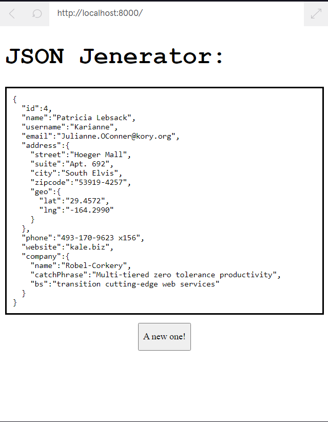

# Introduction to Requests
Have you ever wondered what happens after you click a “Submit” button on a web page? For instance, if you are submitting information, where does the information go? How is the information processed? The answer to the previous questions revolves around HTTP requests.

There are many types of HTTP requests. The four most commonly used types of HTTP requests are GET, POST, PUT, and DELETE. In this lesson, we’ll cover GET and POST requests. If you want to learn more about the different HTTP requests, we recommend the following documentation:

- Mozilla Developer Network: HTTP methods (https://developer.mozilla.org/en-US/docs/Web/HTTP/Methods)

With a GET request, we’re retrieving, or getting, information from some source (usually a website). For a POST request, we’re posting information to a source that will process the information and send it back.

In this lesson, we will explain how to make GET and POST requests by using JavaScript’s XHR object. We’ll also incorporate query strings into our requests.

We’ll use the Datamuse API for GET requests and the Rebrandly URL Shortener API for POST requests. To complete the exercise on POST, make sure you create a Rebrandly API Key by following the instructions in the article below:

- Codecademy Articles: Rebrandly URL Shortener API (https://www.codecademy.com/articles/rebrandly-signup)

**Instructions**

Click the button on the web page to see what the code in main.js does.

You’ll see JSON being displayed on the page. JSON, JavaScript Object Notation, will be the format in which our data is sent to us. That button you click produces a GET request. That’s right, you’ve just made a GET request!

Go to the next exercise to learn more about requests.

**Result**

