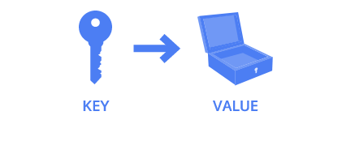
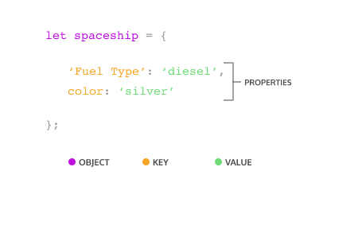
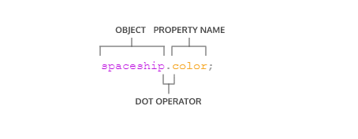
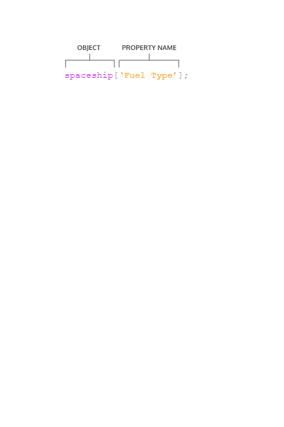
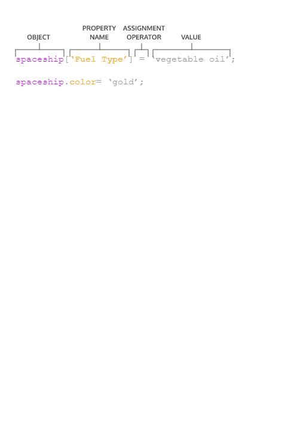

# Introduction to Objects
It’s time to learn more about the basic structure that permeates nearly every aspect of JavaScript programming: objects.

You’re probably already more comfortable with objects than you think, because JavaScript loves objects! Many components of the language are actually objects under the hood, and even the parts that aren’t— like strings or numbers— can still act like objects in some instances.

There are only seven fundamental data types in JavaScript, and six of those are the primitive data types: string, number, boolean, null, undefined, and symbol. With the seventh type, objects, we open our code to more complex possibilities. We can use JavaScript objects to model real-world things, like a basketball, or we can use objects to build the data structures that make the web possible.

At their core, JavaScript objects are containers storing related data and functionality, but that deceptively simple task is extremely powerful in practice. You’ve been using the power of objects all along, but now it’s time to understand the mechanics of objects and start making your own!

# Creating Object Literals
Objects can be assigned to variables just like any JavaScript type. We use curly braces, {}, to designate an object literal:

```js
let spaceship = {}; // spaceship is an empty object
```

We fill an object with unordered data. This data is organized into key-value pairs. A key is like a variable name that points to a location in memory that holds a value.



A key’s value can be of any data type in the language including functions or other objects.

We make a key-value pair by writing the key’s name, or identifier, followed by a colon and then the value. We separate each key-value pair in an object literal with a comma (,). Keys are strings, but when we have a key that does not have any special characters in it, JavaScript allows us to omit the quotation marks:



```js
// An object literal with two key-value pairs
let spaceship = {
  'Fuel Type': 'diesel',
  color: 'silver'
};
```

The spaceship object has two properties Fuel Type and color. 'Fuel Type' has quotation marks because it contains a space character.

Let’s make some objects!

**Instructions**
1. The spaceship we have so far looks good but, unfortunately, is not very fast at hyperspace travel due to having an inferior fuel source. Make a new spaceship object named fasterShip with the same color as spaceship but with a Fuel Type equal to 'Turbo Fuel'.

**Answer**

```js
let fasterShip = {
  'Fuel Type': 'Turbo Fuel',
  color: 'silver'
};
```

# Accessing Properties
There are two ways we can access an object’s property. Let’s explore the first way— dot notation, `.`

You’ve used dot notation to access the properties and methods of built-in objects and data instances:
```js
'hello'.length; // Returns 5
```

With property dot notation, we write the object’s name, followed by the dot operator and then the property name (key):

```js
let spaceship = {
  homePlanet: 'Earth',
  color: 'silver'
};
spaceship.homePlanet; // Returns 'Earth',
spaceship.color; // Returns 'silver',
```



If we try to access a property that does not exist on that object, undefined will be returned.

```js
spaceship.favoriteIcecream; // Returns undefined
Let’s get some more practice using dot notation on an object!
```

**Instructions**

1. Let’s use the dot operator to access the value of numCrew from the spaceship object in the code editor. Create a variable crewCount and assign the spaceship‘s numCrew property to it.
2. Again using the dot operator, create a variable planetArray and assign the spaceship‘s flightPath property to it.

**Answer**
```js
let spaceship = {
  homePlanet: 'Earth',
  color: 'silver',
  'Fuel Type': 'Turbo Fuel',
  numCrew: 5,
  flightPath: ['Venus', 'Mars', 'Saturn']
};

// Write your code below
let crewCount = spaceship.numCrew;
let planetArray = spaceship.flightPath;
```

# Bracket Notation
The second way to access a key’s value is by using bracket notation, `[ ]`.

You’ve used bracket notation when indexing an array:
```js
['A', 'B', 'C'][0]; // Returns 'A'
```

To use bracket notation to access an object’s property, we pass in the property name (key) as a string.



We must use bracket notation when accessing keys that have numbers, spaces, or special characters in them. Without bracket notation in these situations, our code would throw an error.
```js
let spaceship = {
  'Fuel Type': 'Turbo Fuel',
  'Active Duty': true,
  homePlanet: 'Earth',
  numCrew: 5
};
spaceship['Active Duty'];   // Returns true
spaceship['Fuel Type'];   // Returns  'Turbo Fuel'
spaceship['numCrew'];   // Returns 5
spaceship['!!!!!!!!!!!!!!!'];   // Returns undefined
```

With bracket notation you can also use a variable inside the brackets to select the keys of an object. This can be especially helpful when working with functions:
```js
let returnAnyProp = (objectName, propName) => objectName[propName];
 
returnAnyProp(spaceship, 'homePlanet'); // Returns 'Earth'
```

If we tried to write our returnAnyProp() function with dot notation (objectName.propName) the computer would look for a key of 'propName' on our object and not the value of the propName parameter.

Let’s get some practice using bracket notation to access properties!


Instructions
1. Let’s use bracket notation to access the value of 'Active Mission' from the spaceship object in the code editor. Create a variable isActive and assign the spaceship‘s 'Active Mission' property to it.

Hint
```js
let variableName = objectName['propertyName']
```
2. Using bracket notation and the propName variable provided, console.log() the value of the 'Active Mission' property.

Hint
```js
console.log(objectName[variableName])
```

**Answer**
```js
let spaceship = {
  'Fuel Type' : 'Turbo Fuel',
  'Active Mission' : true,
  homePlanet : 'Earth', 
  numCrew: 5
 };

let propName =  'Active Mission';

// Write your code below
let isActive = spaceship[propName];

console.log(isActive);
console.log(spaceship[propName]);
```

# Property Assignment
Once we’ve defined an object, we’re not stuck with all the properties we wrote. Objects are mutable meaning we can update them after we create them!

We can use either dot notation, ., or bracket notation, [], and the assignment operator, = to add new key-value pairs to an object or change an existing property.



One of two things can happen with property assignment:

- If the property already exists on the object, whatever value it held before will be replaced with the newly assigned value.
- If there was no property with that name, a new property will be added to the object.

It’s important to know that although we can’t reassign an object declared with const, we can still mutate it, meaning we can add new properties and change the properties that are there.
```js
const spaceship = {type: 'shuttle'};
spaceship = {type: 'alien'}; // TypeError: Assignment to constant variable.
spaceship.type = 'alien'; // Changes the value of the type property
spaceship.speed = 'Mach 5'; // Creates a new key of 'speed' with a value of 'Mach 5'
```

You can delete a property from an object with the delete operator.
```js
const spaceship = {
  'Fuel Type': 'Turbo Fuel',
  homePlanet: 'Earth',
  mission: 'Explore the universe' 
};
 
delete spaceship.mission;  // Removes the mission property
```

Instructions
1. Reassign the color property of the spaceship object to have a value of 'glorious gold'
2. Without changing lines 1 - 6, add a numEngines property with a numeric value between 1 and 10 to the spaceship object.

Hint
```js
objectName['Property Name'] = 'New Property Value';
objectName.propName = 'New Prop Value';
```
3. Use the delete operator to remove the 'Secret Mission' property from the spaceship object.

Hint
```js
delete objectName['Property Name'];
delete objectName.propName;
```

**Answer**
```js
let spaceship = {
  'Fuel Type' : 'Turbo Fuel',
  homePlanet : 'Earth',
  color: 'silver',
  'Secret Mission' : 'Discover life outside of Earth.'
};

// Write your code below
spaceship.color = 'glorious gold';
spaceship.numEngines = 9;

delete spaceship['Secret Mission'];
```

**Instructions**
1. Below the retreatMessage variable in the code editor, create an alienShip object. It should contain a method .retreat() which will console.log() the retreatMessage.

Hint
```js
let objectName = {
  methodName() {
    console.log('The methodName method was invoked!')
  }
};
```
2. Add another method to your object literal. This method, .takeOff(), should console.log() the string 'Spim... Borp... Glix... Blastoff!'.

Hint

Don’t forget to separate your methods with commas just as you would any other key-value pairs:
```js
let objectName = {
  methodName() {
    console.log('The methodName method was invoked!')
  }, 
  secondMethodName() {
     console.log('The secondMethodName method was invoked!')
}
};
```
3. Invoke your two methods: first .retreat() then .takeOff().

Hint
```js
objectName.methodName()
```

**Answer**
```js
let retreatMessage = 'We no longer wish to conquer your planet. It is full of dogs, which we do not care for.';

// Write your code below
const alienShip = {
  retreat () {
    console.log(retreatMessage);
  },
  takeOff () {
    console.log('Spim... Borp... Glix... Blastoff!')
  }
}

alienShip.retreat();
alienShip.takeOff();
```

# Nested Objects
In application code, objects are often nested— an object might have another object as a property which in turn could have a property that’s an array of even more objects!

In our spaceship object, we want a crew object. This will contain all the crew members who do important work on the craft. Each of those crew members are objects themselves. They have properties like name, and degree, and they each have unique methods based on their roles. We can also nest other objects in the spaceship such as a telescope or nest details about the spaceship’s computers inside a parent nanoelectronics object.
```js
const spaceship = {
     telescope: {
        yearBuilt: 2018,
        model: '91031-XLT',
        focalLength: 2032 
     },
    crew: {
        captain: { 
            name: 'Sandra', 
            degree: 'Computer Engineering', 
            encourageTeam() { console.log('We got this!') } 
         }
    },
    engine: {
        model: 'Nimbus2000'
     },
     nanoelectronics: {
         computer: {
            terabytes: 100,
            monitors: 'HD'
         },
        'back-up': {
           battery: 'Lithium',
           terabytes: 50
         }
    }
}; 
```

We can chain operators to access nested properties. We’ll have to pay attention to which operator makes sense to use in each layer. It can be helpful to pretend you are the computer and evaluate each expression from left to right so that each operation starts to feel a little more manageable.
```js
spaceship.nanoelectronics['back-up'].battery; // Returns 'Lithium'
```

In the preceding code:

- First the computer evaluates spaceship.nanoelectronics, which results in an object containing the back-up and computer objects.
- We accessed the back-up object by appending ['back-up'].
- The back-up object has a battery property, accessed with .battery which returned the value stored there: 'Lithium'


