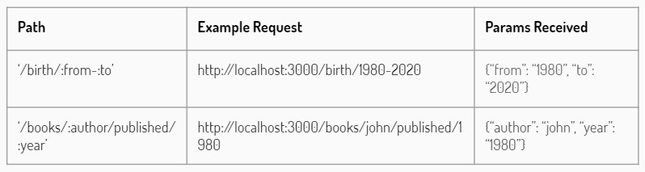

# What is Express.js?
> Express is a light-weight web application framework to help organize your web application into an MVC architecture on the server side.

# What to build with Express?
- Real time chat
- Single page application
- Real time collaboration tools
- Streaming apps
- Microservices architecture

# Installing Express.js
Express gets installed via the Node Package Manager. This can be done by executing the following line in the command line.
```
npm init -y
npm install express
```

# Buat basic app.js
```
const express = require('express')
const app = express()
const port = 3000 // biasanya port developer 3000

app.get('/', function(request, response) { // handle request 'localhost:3000/'
    response.send('Hello World')
}) // get -> method yg dilakukan o/ si browser thd aplikasi kita.

app.get('/about', function(request, response) { // handle request 'localhost:3000/about'
    response.send('This is about page')
})

app.get('/profile', function(req, res) {
    res.send('This is profile page')
})

app.listen(port, function() {
  console.log('this app running on port :', port)
})
```

# Template Engine - EJS
-> agar tampilan lebih bagus, gacuma bentuk `p` html aja.

https://expressjs.com/en/guide/using-template-engines.html

https://ejs.co/

# Routing
- Routing refers to how an application's expoints(URls) respond to client requests.
- In other words, the application "**listens**" for requests that match the specified routes(s) and method(s), and when it detects a match, it calls the specified callback function.

Basic routing:
```js
const express = require('express')
const app = express()

app.get('/', function(req, res) {
  res.send('Hello World')
})

app.listen(3000, function() {
  res.send('Server listening on port 3000')
})
```

# Route Method
A route method is derived from one of the HTTP methods, and is attached to an instance of the express class.

Commonly used methods.
- GET : Used to **read** (or retrieve) a representation of a resource.
- POST : is most-often utilized to **create** new resources
- PUT : is most-often utilized for **update** capabilities, PUT-ing to a known resource URl with the request body containing the newly-updated representation of the original resource
- DELETE : is used to **delete** a resource identified by a URl

# Route Path
Route path is a endpoint definition at which request can be made. Route path can be string, string pattern or even regular expressions.

Example:

Route path that match "/contact" request
```js
const express = require('express')
const app = express()

app.get('/contact', function(req, res) {
  res.send('GET method Hello World')
})

app.listen(3000, function() {
  res.send('Server listening on port 3000')
})
```

Other examples :
- `'/about*'` : This route path will match about_me, about-company, aboutus, and so on.
- `/me/` : This route path will match anything with "me" in it's request path
- `/.*fly$` : This route path will match anything ends with "fly" such as dragonfly but not dragonflyman

# Route Dynamic Parameters
Route parameters are named URl segments that are used to capture the values specified at their position in the URl. THe captured values are populated in the req.params object, with the name of the route parameter specified in the path as their respective keys.

Example:

Route path that match "/article/l" or "/article/lorem-ipsum" request
```js
const express = require('express')
const app = express()

app.get('/article/:id', function(req, res) {
  res.send(`Article detail ${req.params.id}`)
})

app.listen(3000, function() {
  res.send('Server listening on port 3000')
})
```

Other examples:


# Route Handler
Handler is a callback function that executes when a matching request type is found on the relevant route. It can be can in the form of a function, an array of functions, or combinations of both.
```js
const express = require('express')
const app = express()

app.get('/article/:id', function (req, res) {
  const id = req.params.id
  const toLower = id.toLowerCase()
  res.send(id)
})

app.listen(3000, function() {
  res.send('Server listening on port 3000')
})
```
