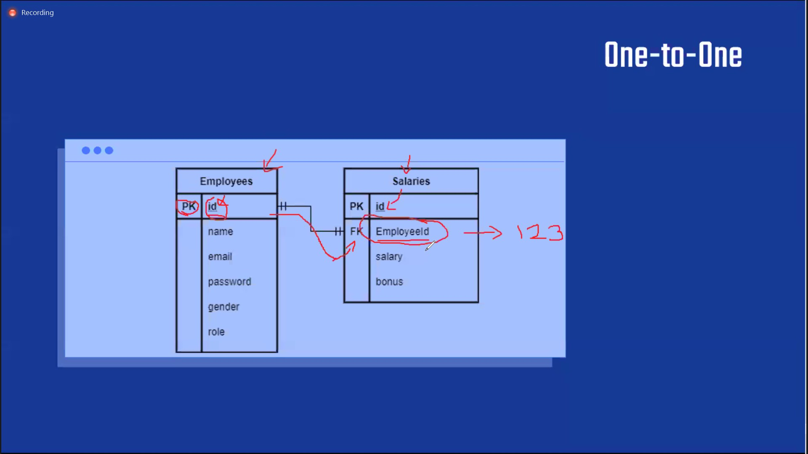
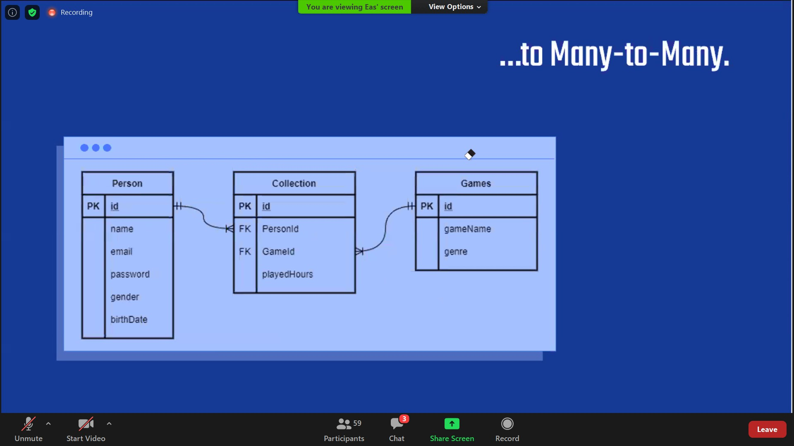
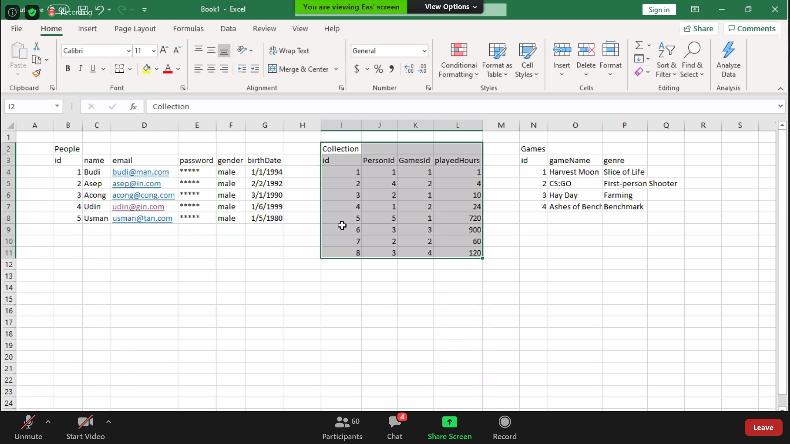
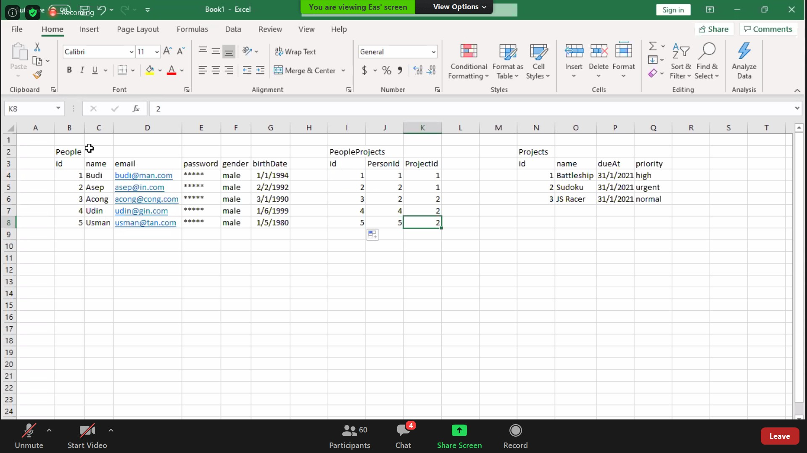

# Database
- Wadah penyimpanan data-data yang kita input
- Eliminasi redudancy (datanya duplikat di berbagai tempat)
- Makes data easily accessible across platform(s)/app(s)

Nama table -> jamak
PK ID itu sellau autoincrement

# Relasi database
1. One to One -> a couple. Sebuah pasangan. Si a punya si b, si b punya si a. Dia gapunya hubungan dengan table lain
- Contoh : Employees & salaries
- Employees id (PK) dan Salaries (FK EmployeeId)
- FK (Foreign Key) -> kunci/referensi table lain
- Contoh: Asep(Employees) punya gaji+bonus, nah kenapa si table salaries tau gaji+bonus sekian itu milik Asep?? karna di table salaries ada FK EmployeeId

2. One to Many -> seperti kita punya koleksi game kita
- Si People punya beberapa koleksi game
- Employees dan Projects -> si employee punya banyak project yg dia handle

3. Many to Many
- Contoh: gameName sama genre itu kan bisa duplikat, jd dibuat table baru
Junction table -> penengah antara data people dan data games. Contohnya adalah Collection, yaitu penengah antara People dan Games.
Yang mana table penengah akan merefer ke table people dan table game, melalui foreign key(gamesId).
- Contoh Employees dan Projects, dimana employee bisa punya banyak projects, dan projects bisa dikerjain banyak employees.
Junction table -> PeopleProjects

